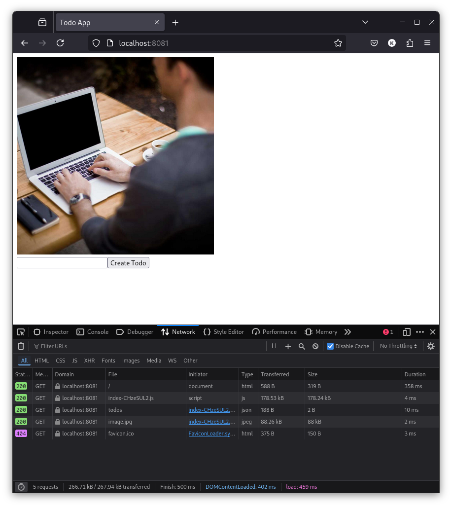
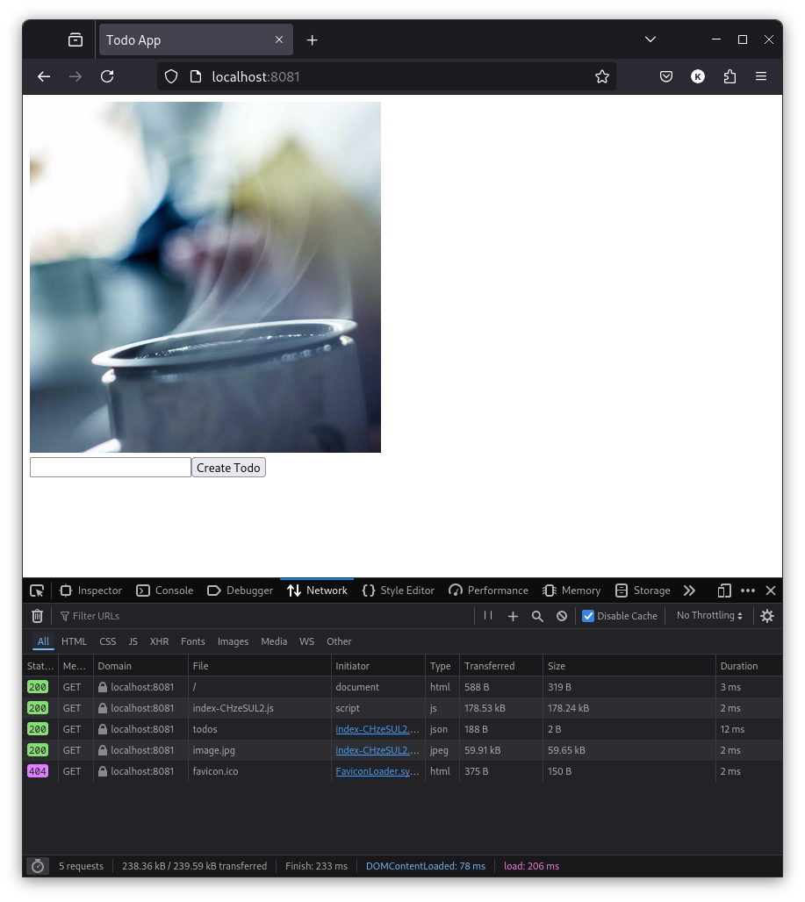
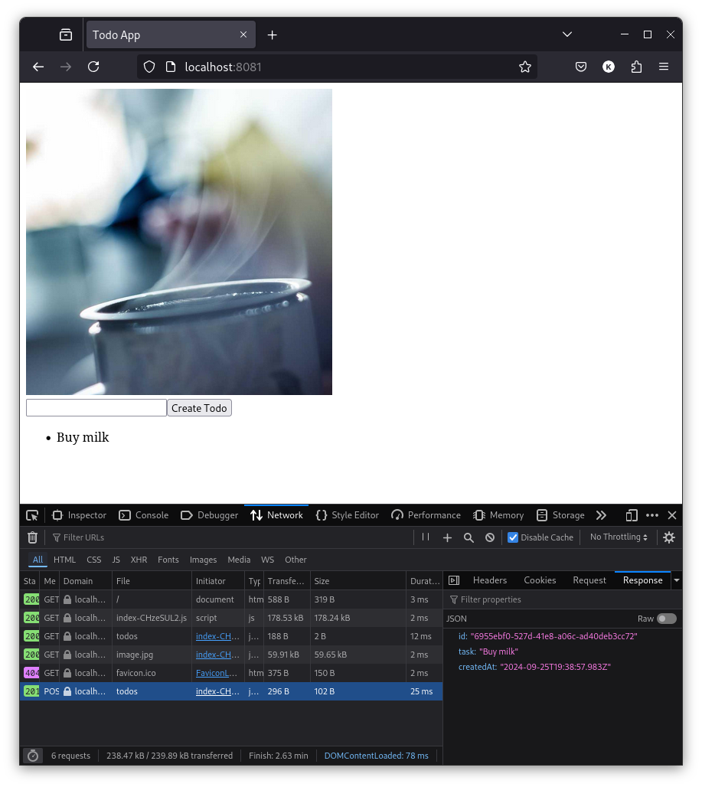
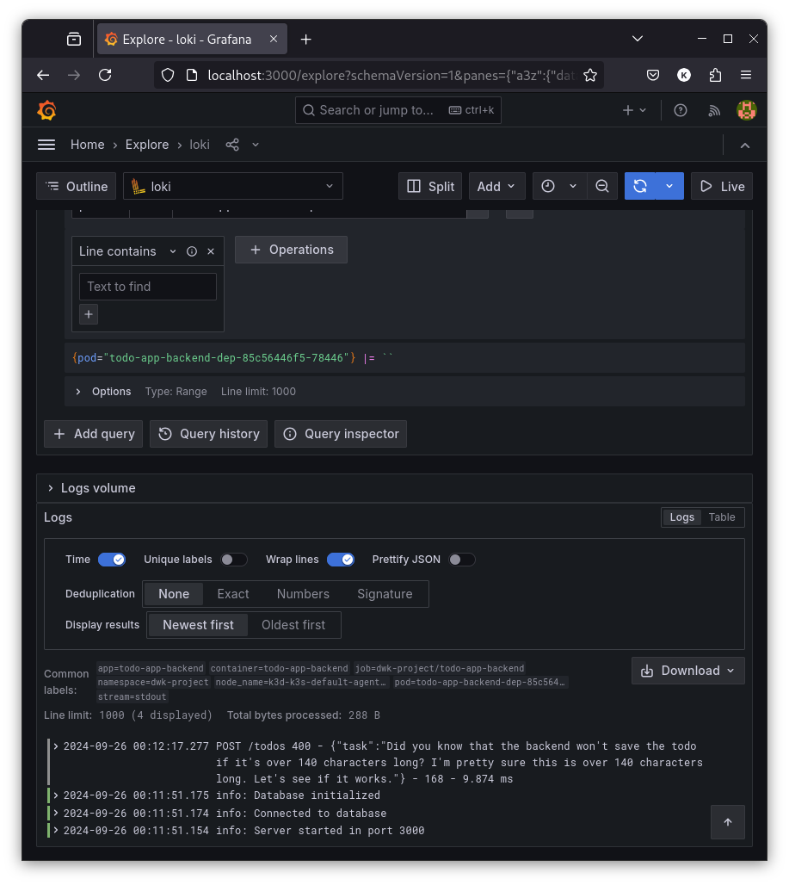

# Exercises

## 1.02

- Build the image and push it to Docker Hub

  ```sh
  $ docker build . -t vkantanen/todo-app-project:1.02
  $ docker push vkantanen/todo-app-project:1.02
  ```

- Create a deployment using the image

  ```sh
  $ kubectl create deployment todo-app-project-dep --image=vkantanen/todo-app-project:1.02
  deployment.apps/todo-app-project-dep created
  ```

- Get the name of the pod and check the logs

  ```sh
  $ kubectl get pods
  NAME                                    READY   STATUS    RESTARTS   AGE
  todo-app-project-dep-7cd65d984d-b42fs   1/1     Running   0          8s

  $ kubectl logs -f todo-app-project-dep-7cd65d984d-b42fs
  Server started in port 3000
  ```

## 1.04

- Create a new deployment

  ```sh
  $ kubectl apply -f manifests/deployment.yaml 
  deployment.apps/todo-app-project-dep created
  ```

- Get the name of the pod and check the logs

  ```sh
  $ kubectl get pods
  NAME                                   READY   STATUS    RESTARTS   AGE
  log-output-dep-6869bc475f-r6nfg        1/1     Running   0          5m8s
  todo-app-project-dep-bfff7d448-9wb8m   1/1     Running   0          16s

  $ kubectl logs -f todo-app-project-dep-bfff7d448-9wb8m
  Server started in port 3000
  ```

## 1.05

- Build a new version of the image and push it to Docker Hub

  ```sh
  $ docker build . -t vkantanen/todo-app-project:1.05
  $ docker push vkantanen/todo-app-project:1.05
  ```

- Update [`manifests/deployment.yaml`](manifests/deployment.yaml) to use the new image

  ```diff
  spec:
    containers:
      - name: todo-app-project
  -     image: vkantanen/todo-app-project:1.02
  +     image: vkantanen/todo-app-project:1.05
  ```

- Update the deployment

  ```sh
  $ kubectl apply -f manifests/deployment.yaml
  deployment.apps/todo-app-project-dep configured
  ```

- Get the name of the pod and check the logs

  ```sh
  $ kubectl get pods
  NAME                                    READY   STATUS        RESTARTS   AGE
  log-output-dep-6869bc475f-r6nfg         1/1     Running       0          25m
  todo-app-project-dep-5bb5897669-d2j54   1/1     Running       0          10s
  todo-app-project-dep-bfff7d448-9wb8m    1/1     Terminating   0          20m

  $ kubectl logs -f todo-app-project-dep-5bb5897669-d2j54
  Server started in port 3000
  ```

- Forward the port

  ```sh
  $ kubectl port-forward todo-app-project-dep-5bb5897669-d2j54 3003:3000
  Forwarding from 127.0.0.1:3003 -> 3000
  Forwarding from [::1]:3003 -> 3000
  ```

- Test the application (in another terminal)

  ```sh
  $ curl http://localhost:3003
  <h1>Hello from Kubernetes!</h1>
  ```

## 1.06

- Add [`manifests/service.yaml`](manifests/service.yaml)

- Delete the old cluster

  ```sh
  $ k3d cluster delete
  INFO[0000] Deleting cluster 'k3s-default'
  ...
  INFO[0001] Successfully deleted cluster k3s-default!
  ```

- Create a new cluster

  ```sh
  $ k3d cluster create --port 8082:30080@agent:0 -p 8081:80@loadbalancer --agents 2
  INFO[0000] portmapping '8081:80' targets the loadbalancer: defaulting to [servers:*:proxy agents:*:proxy] 
  INFO[0000] Prep: Network                                
  INFO[0000] Created network 'k3d-k3s-default'
  ...
  INFO[0016] Cluster 'k3s-default' created successfully!
  ```

- Create a new deployment

  ```sh
  $ kubectl apply -f manifests/deployment.yaml
  deployment.apps/todo-app-project-dep created
  ```

- Create a new service

  ```sh
  $ kubectl apply -f manifests/service.yaml
  service/todo-app-project-svc created
  ```

- Test the application

  ```sh
  $ curl http://localhost:8082
  <h1>Hello from Kubernetes!</h1>
  ```

## 1.08

- Delete the ingress of log-output

  ```sh
  $ kubectl delete ingress log-output-ingress
  ingress.networking.k8s.io "log-output-ingress" deleted
  ```

- Create [`ingress.yaml`](manifests/ingress.yaml) and update [`service.yaml`](manifests/service.yaml)

- Apply the manifests

  ```sh
  $ kubectl apply -f manifests/
  deployment.apps/todo-app-project-dep unchanged
  ingress.networking.k8s.io/todo-app-project-ingress created
  service/todo-app-project-svc configured
  ```

- Test the application

  ```sh
  $ curl http://localhost:8081
  <h1>Hello from Kubernetes!</h1>
  ```

## 1.12

- Build a new version of the image and push it to Docker Hub

  ```sh
  $ docker build . -t vkantanen/todo-app-project:1.12
  $ docker push vkantanen/todo-app-project:1.12
  ```

- Update [`deployment.yaml`](manifests/deployment.yaml)

- Apply the manifests

  ```sh
  $ kubectl apply -f ../manifests/
  persistentvolumeclaim/ping-pong-claim created
  persistentvolume/dwk-pv created

  $ kubectl apply -f manifests/
  deployment.apps/todo-app-project-dep created
  ingress.networking.k8s.io/todo-app-project-ingress created
  service/todo-app-project-svc created
  ```

- Test the application

  ```sh
  $ curl http://localhost:8081
  <html>
    <body>
      <h1>Hello from Kubernetes!</h1>
      
    </body>
  </html>
  ```

- Delete and recreate the deployment

  ```sh
  $ kubectl delete deployment todo-app-project-dep
  deployment.apps "todo-app-project-dep" deleted

  $ kubectl apply -f manifests/deployment.yaml
  deployment.apps/todo-app-project-dep created
  ```

- On the browser, we can still see the same picture that was shown before deleting the deployment

## 1.13

- Add an input field, a send button and a list of todos to the application

- Build a new version of the image and push it to Docker Hub

  ```sh
  $ docker build . -t vkantanen/todo-app-project:1.13
  $ docker push vkantanen/todo-app-project:1.13
  ```

## 2.02

- Build new images and push them to Docker Hub

  ```sh
  $ docker build . -t vkantanen/todo-app-project:2.02
  $ docker push vkantanen/todo-app-project:2.02
  $ docker build . -t vkantanen/todo-app-backend:2.02
  $ docker push vkantanen/todo-app-backend:2.02
  ```

- Update [`ingress.yaml`](todo-app/manifests/ingress.yaml) and [`deployment.yaml`](todo-app/manifests/deployment.yaml) of `todo-app`

- Add [`deployment.yaml`](todo-backend/manifests/deployment.yaml) and [`service.yaml`](todo-backend/manifests/service.yaml) for `todo-backend`

- Apply the manifests

  ```sh
  $ kubectl apply -f todo-app/manifests/
  deployment.apps/todo-app-project-dep created
  ingress.networking.k8s.io/todo-app-project-ingress created
  service/todo-app-project-svc created
  $ kubectl apply -f todo-backend/manifests/
  deployment.apps/todo-app-backend-dep created
  service/todo-app-backend-svc created
  ```

- Test the application

  
  

  ```sh
  $ curl http://localhost:8081/todos
  [{"id":"06156b3a-1dc7-45d3-8314-e8ff8ce51393","task":"Buy milk","createdAt":"2024-09-24T20:53:24.031Z"}]
  ```

## 2.04

- Create a namespace `dwk-project`

  ```sh
  $ kubectl create namespace dwk-project
  namespace/dwk-project created
  ```

- Add [`persistent-volume-claim.yaml`](./todo-app/manifests/persistent-volume-claim.yaml) for `todo-app`

- Update the manifests to use the namespace `dwk-project`

## 2.08

- Build a new image for `todo-backend` and push it to Docker Hub

  ```sh
  $ docker build . -t vkantanen/todo-app-backend:2.08
  $ docker push vkantanen/todo-app-backend:2.08
  ```

- Create `secret.yaml` and [`postgres.yaml`](./todo-backend/manifests/postgres.yaml) for `todo-backend` and update [`deployment.yaml`](./todo-backend/manifests/deployment.yaml)

- Encrypt the `secret.yaml` with `sops` and delete the original file

  ```sh
  $ sops --encrypt \
         --age age1ng3clrslk9jrqhjtp4yev3x33qwlt2tp58j5na5qm6mevej6hdxslhcqq2 \
         --encrypted-regex '^(data)$' \
         manifests/secret.yaml > manifests/secret.enc.yaml
  $ rm manifests/secret.yaml
  ```

- Apply the manifests

  ```sh
  $ kubectl apply -f ../todo-app/manifests
  deployment.apps/todo-app-project-dep created
  ingress.networking.k8s.io/todo-app-project-ingress created
  persistentvolumeclaim/todo-app-claim created
  service/todo-app-project-svc created

  $ sops --decrypt manifests/secret.enc.yaml | kubectl apply -f -
  secret/postgres-secret created

  $ kubectl apply -f manifests/deployment.yaml,manifests/postgres.yaml,manifests/service.yaml
  deployment.apps/todo-app-backend-dep created
  service/postgres-svc created
  statefulset.apps/postgres-sts created
  service/todo-app-backend-svc created
  ```

- Test the application

  
  

  ```sh
  $ curl http://localhost:8081/todos
  [{"id":"6955ebf0-527d-41e8-a06c-ad40deb3cc72","task":"Buy milk","createdAt":"2024-09-25T19:38:57.983Z"}]

  $ kubectl get pods
  NAME                                    READY   STATUS    RESTARTS   AGE
  postgres-sts-0                          1/1     Running   0          9m16s
  todo-app-backend-dep-64ffd4f68c-6zmvx   1/1     Running   0          5m6s
  todo-app-project-dep-784585748c-k96w6   1/1     Running   0          9m26s

  $ kubectl exec postgres-sts-0 -- psql -U postgres -c "SELECT * FROM todos"
                    id                  |   task   |         created_at         
  --------------------------------------+----------+----------------------------
   6955ebf0-527d-41e8-a06c-ad40deb3cc72 | Buy milk | 2024-09-25 19:38:57.983302
  (1 row)
  ```

## 2.09

- Build an image for `todo-cron` and push it to Docker Hub

  ```sh
  $ docker build . -t vkantanen/todo-cron:2.09
  $ docker push vkantanen/todo-cron:2.09
  ```

- Create [`cronjob.yaml`](./todo-backend/manifests/cronjob.yaml) for `todo-backend`
  - Schedule was first set to `* * * * *` for testing purposes

- Apply the manifest

  ```sh
  $ kubectl apply -f manifests/cronjob.yaml
  cronjob.batch/todo-cron created
  ```

- Test the application

  ```sh
  $ curl http://localhost:8081/todos
  [{"id":"6955ebf0-527d-41e8-a06c-ad40deb3cc72","task":"Buy milk","createdAt":"2024-09-25T19:38:57.983Z"},{"id":"234e8260-c048-4831-ae75-8aafc97a9fac","task":"Read https://en.wikipedia.org/wiki/Subhash_Maharia","createdAt":"2024-09-25T20:44:03.413Z"}]
  ```

## 2.10

- Build a new image for `todo-backend` and push it to Docker Hub

  ```sh
  $ docker build . -t vkantanen/todo-app-backend:2.10
  $ docker push vkantanen/todo-app-backend:2.10
  ```

- Update [`deployment.yaml`](./todo-backend/manifests/deployment.yaml)

- Apply the manifest

  ```sh
  $ kubectl apply -f todo-backend/manifests/deployment.yaml
  deployment.apps/todo-app-backend-dep configured
  ```

- Install Helm, Prometheus, and Loki like in the [material](https://devopswithkubernetes.com/part-2/5-monitoring)

- Forward the port

  ```sh
  $ kubectl get pods -n prometheus | grep grafana | awk '{print $1}'
  kube-prometheus-stack-1727299895-grafana-678977f64-lx7lg
  
  $ kubectl -n prometheus port-forward kube-prometheus-stack-1727299895-grafana-678977f64-lx7lg 3000
  Forwarding from 127.0.0.1:3000 -> 3000
  Forwarding from [::1]:3000 -> 3000
  ```

- Test the applicaation

  ```sh
  $ curl -X POST http://localhost:8081/todos \
    -H "Content-Type: application/json" \
    -d "{\"task\": \"Did you know that the backend won't save the todo if it's over 140 characters long? I'm pretty sure this is over 140 characters long. Let's see if it works.\"}"
  {"error":"Task cannot be longer than 140 characters"}

  $ curl http://localhost:8081/todos
  [{"id":"6955ebf0-527d-41e8-a06c-ad40deb3cc72","task":"Buy milk","createdAt":"2024-09-25T19:38:57.983Z"},{"id":"234e8260-c048-4831-ae75-8aafc97a9fac","task":"Read https://en.wikipedia.org/wiki/Subhash_Maharia","createdAt":"2024-09-25T20:44:03.413Z"}]
  ```

  

## 3.03

- Create a new namespace `dwk-project` in the cluster

  ```sh
  $ kubectl create namespace dwk-project
  namespace/dwk-project created
  ```

- Add [`kustomization.yaml`](./kustomization.yaml)

- Add a route `GET /` to `todo-backend` that responds with a status code of 200

- Update all manifests in `todo-app/manifests` and `todo-backend/manifests`

- Create a service account for GKE and a key for it like in the [material](https://devopswithkubernetes.com/part-3/2-deployment-pipeline#github-actions)

- Add [GHA workflow](./.github/workflows/main.yml) for building, pushing, and deploying the images

## 3.04

- Delete namespaces from manifests

- Update [GHA workflow](./.github/workflows/main.yml)
